## 👤 Auteur

**Saad Bendahou**
# 🛒 E-Commerce Microservices Application

Application e-commerce complète avec architecture microservices Spring Boot, Keycloak, Kafka et chatbot IA.

---

## 📐 Architecture

Diagramme de l'architecture globale du système:


---

## 🗄️ Bases de Données H2

Les microservices utilisent des bases de données H2 en mémoire pour le développement.

### Customer Database
Console H2 du service Customer montrant la table des clients:

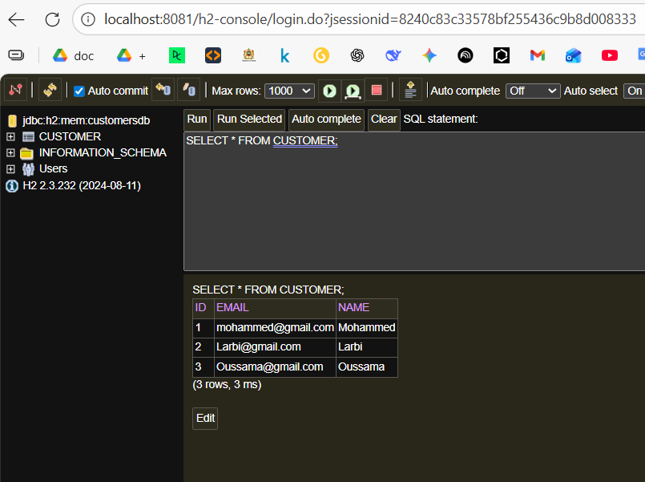

### Inventory Database
Console H2 du service Inventory montrant la table des produits:

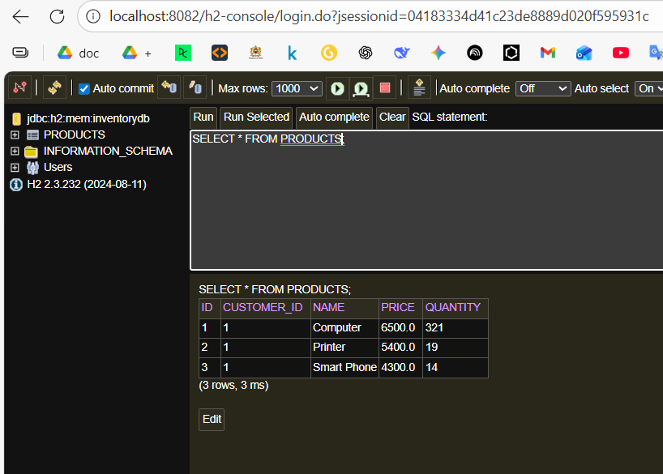

### Billing Database
Console H2 du service Billing montrant les tables de facturation:

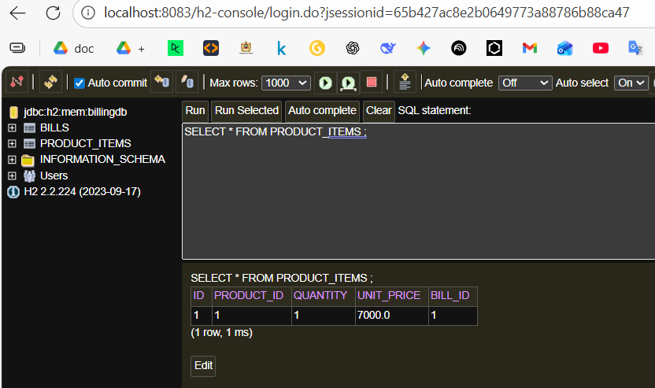

---

## 📊 Eureka Dashboard

Service Discovery avec Netflix Eureka montrant tous les microservices enregistrés:

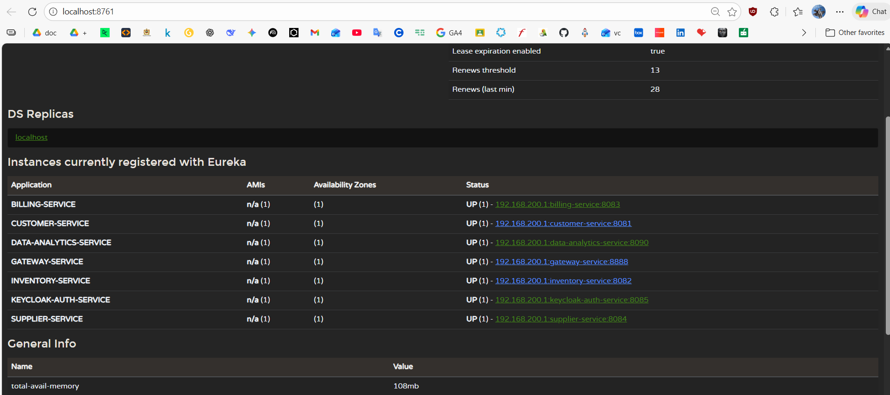

---

## 🔐 Keycloak - Authentification

Configuration et interface d'authentification avec Keycloak.

### Console d'Administration Keycloak
Interface d'administration Keycloak montrant la gestion des clients:

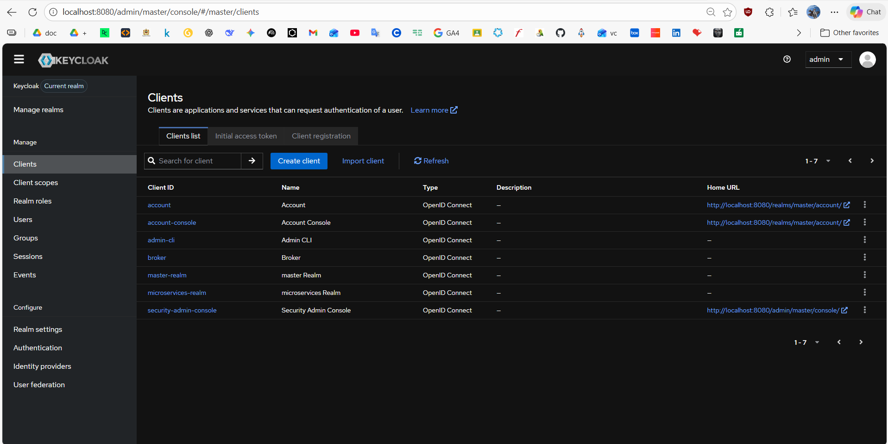

### Page de Connexion Keycloak
Page de connexion pour l'administration Keycloak:

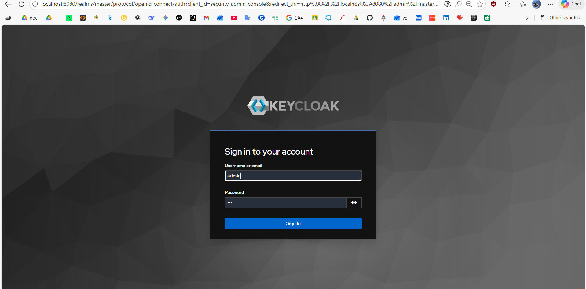

### Page de Connexion OIDC
Page de connexion OpenID Connect pour l'application Angular:


---

## 🌐 Interface Utilisateur (Frontend Angular)

### Page d'Accueil / Dashboard
Page principale de l'application avec vue d'ensemble (customers, products, bills):

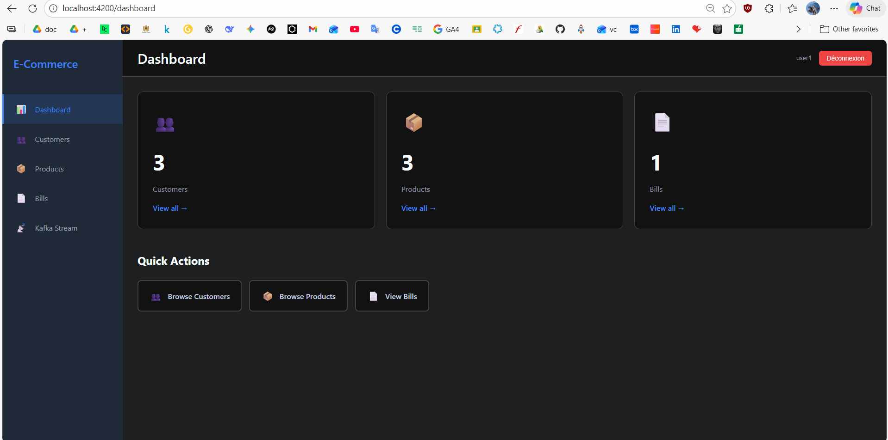

### Gestion des Clients
Interface de gestion des clients avec liste et actions:

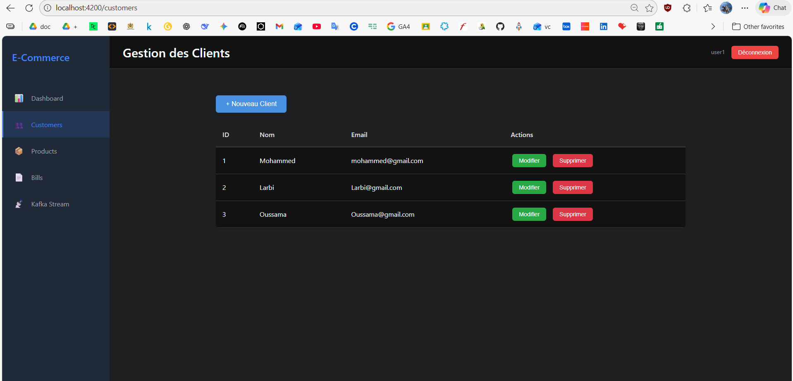

### Gestion des Produits
Interface de gestion des produits avec liste et actions:

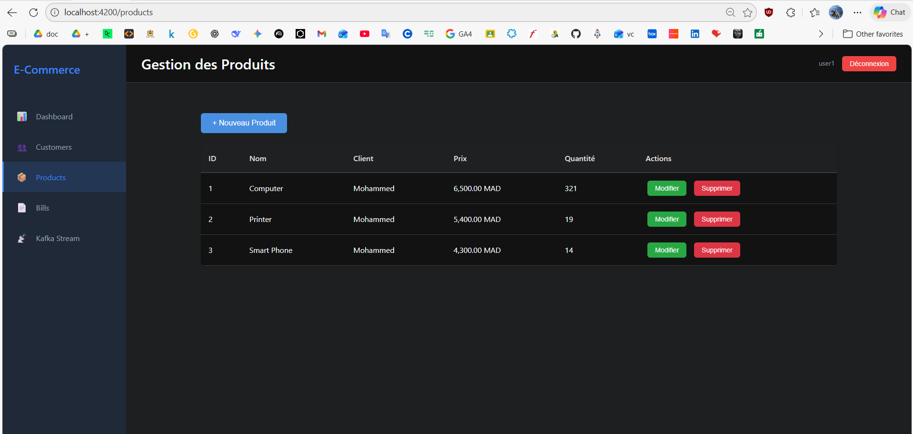

### Gestion des Factures
Interface de gestion des factures avec liste et actions:

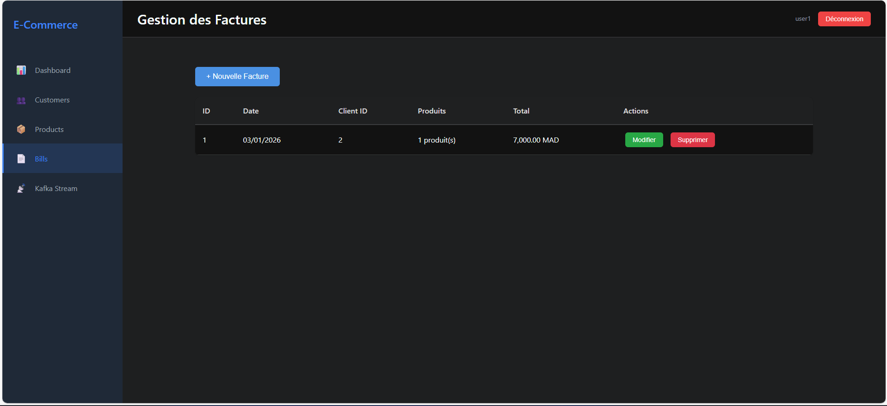

### Dashboard Kafka Stream
Interface de monitoring des événements Kafka en temps réel:

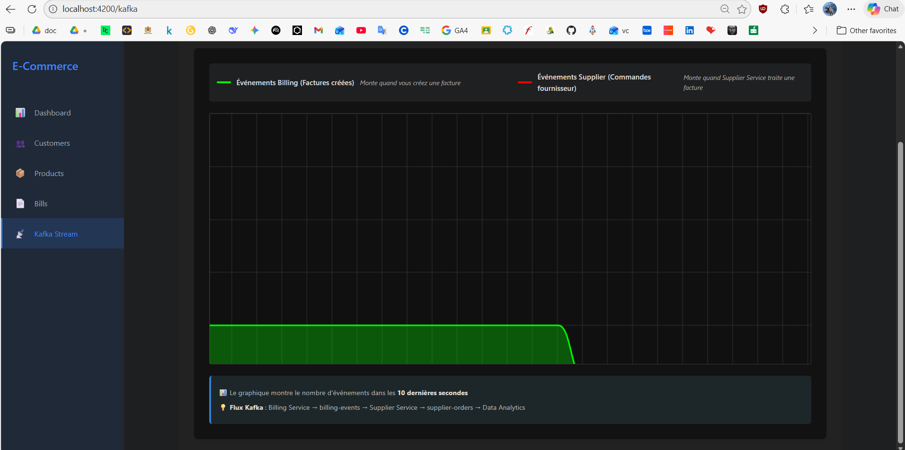

---

## 🔗 API REST Endpoints

Démonstration des endpoints REST exposés par les microservices avec réponses JSON.

### API Customers
Réponse JSON de l'endpoint `/api/customers`:

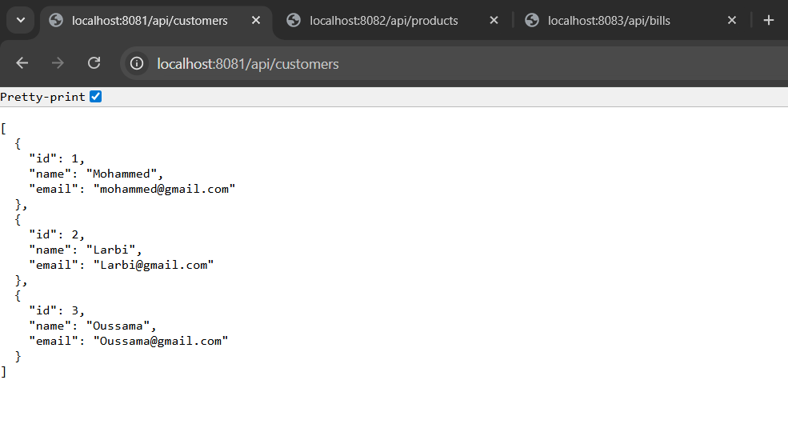

### API Products
Réponse JSON de l'endpoint `/api/products`:

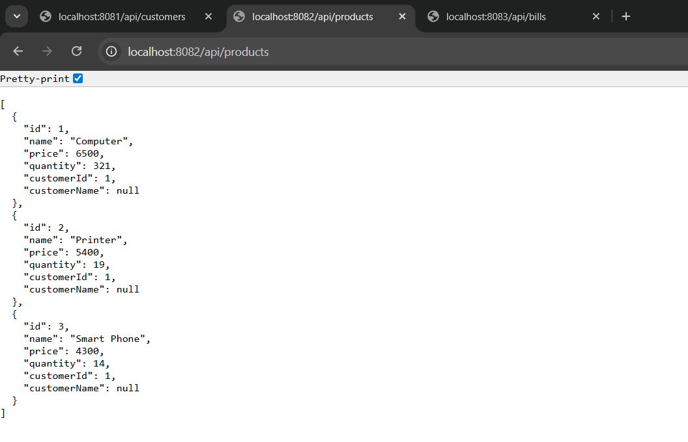

### API Bills
Réponse JSON de l'endpoint `/api/bills`:

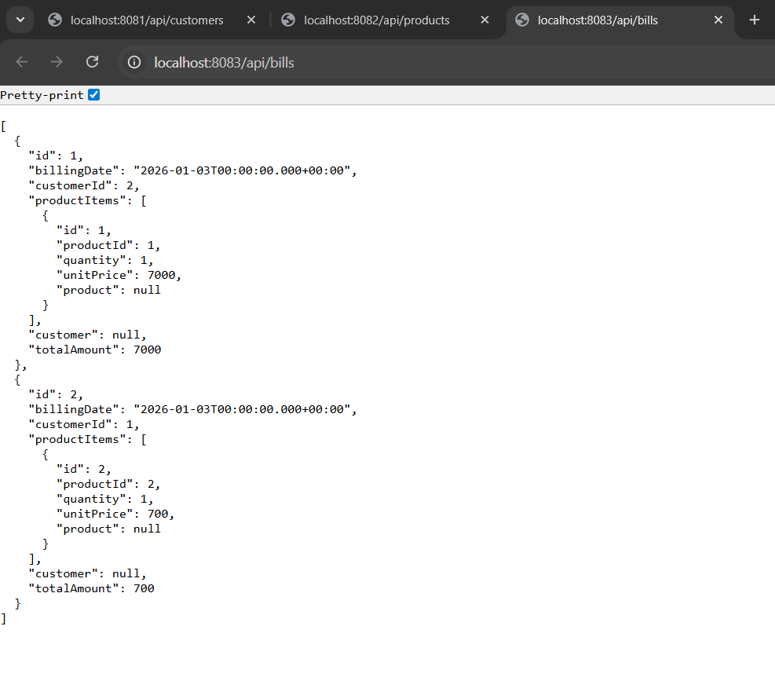

---

## 🤖 Chatbot Telegram (Gemini AI)

Bot Telegram intégré avec Gemini AI pour assistance client.

### Conversation avec le Bot
Exemples d'interactions avec le chatbot:

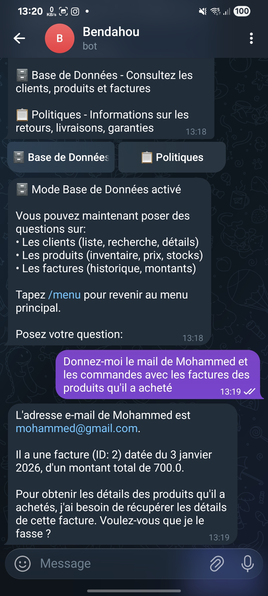

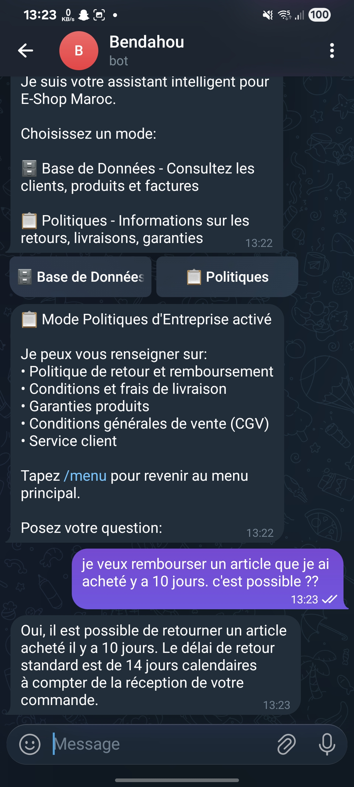

---

## 🚀 Démarrage Rapide

```bash
.\start-all.bat
```

### Services et Ports

| Service | Port | Description |
|---------|------|-------------|
| Eureka | 8761 | Service Discovery |
| Gateway | 8888 | API Gateway |
| Customer | 8081 | Gestion Clients |
| Inventory | 8082 | Gestion Produits |
| Billing | 8083 | Facturation |
| Chatbot | 8087 | Bot IA Telegram |
| MCP Server | 8989 | Outils IA |
| Keycloak | 8080 | Authentification |

### Consoles H2

| Service | URL | JDBC URL | User |
|---------|-----|----------|------|
| Customer | http://localhost:8081/h2-console | `jdbc:h2:mem:customersdb` | `sa` |
| Inventory | http://localhost:8082/h2-console | `jdbc:h2:mem:inventorydb` | `sa` |
| Billing | http://localhost:8083/h2-console | `jdbc:h2:mem:billingdb` | `sa` |

---


